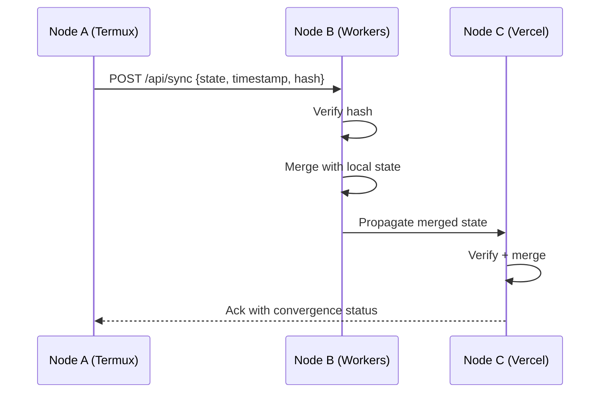

# STATE_CRDT Contract

## Protocol Version: 1.0.0

### Purpose
Conflict-free Replicated Data Type (CRDT) protocol for state synchronization across CIMEIKA organism nodes.

### Strategy
**Last-Write-Wins (LWW)** with lamport timestamps and SHA-256 state hashing.

### State Structure

```json
{
  "node_id": "string (unique identifier)",
  "timestamp": "ISO 8601 datetime",
  "lamport_clock": "integer (monotonic counter)",
  "state": {
    "orhanizm": {},
    "formatsiyi": {},
    "abilities_registry": {}
  },
  "hash": "SHA-256 hex string",
  "vector_clock": {
    "node_1": 42,
    "node_2": 38
  }
}
```

### Merge Algorithm

1. **Timestamp Comparison**: Higher lamport_clock wins
2. **Hash Verification**: SHA-256(canonical_json(state)) must match
3. **Conflict Resolution**: Per-key LWW merge
4. **Convergence**: All nodes eventually reach identical hash

### Hash Computation

**Canonical JSON**:
- Keys sorted alphabetically
- No whitespace
- UTF-8 encoding

**SHA-256**:
- Cloudflare Workers: `crypto.subtle.digest('SHA-256', ...)`
- Python/Vercel: `hashlib.sha256(...).hexdigest()`
- Node.js/Termux: `crypto.createHash('sha256').update(...).digest('hex')`

### Synchronization Flow



### Validation Rules

- **Hash mismatch** → Reject + request full state
- **Timestamp regression** → Ignore update
- **Network partition** → Queue updates, replay on reconnect
- **State drift** → Full sync every N minutes

### Implementation Requirements

- Atomic writes to manifest.json
- Append-only operation log
- Periodic garbage collection of old states
- Conflict metadata preserved for debugging